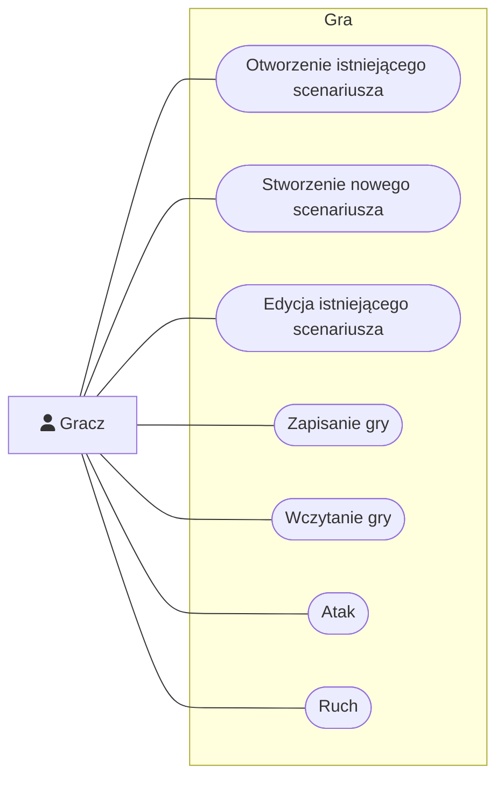

```mermaid
graph LR;
    subgraph Gra;
      U01([ Otworzenie istniejącego scenariusza]);
      U02([ Stworzenie nowego scenariusza]);
      U03([ Edycja istniejącego scenariusza]);
      U04([ Zapisanie gry]);
      U05([ Wczytanie gry]);
      U06([ Atak]);
      U07([ Ruch]);
    end;

Gracz[fa:fa-user Gracz];

Gracz --- U01;
Gracz --- U02;
Gracz --- U03;
Gracz --- U04;
Gracz --- U05;
Gracz --- U06;
Gracz --- U07;
```
