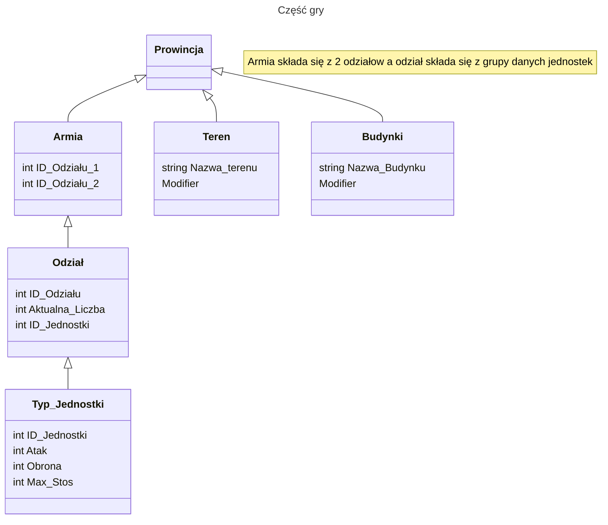

```mermaid

---
title: Część gry
---
classDiagram
    Odział <|-- Typ_Jednostki
    note "Armia składa się z 2 odziałow a odział składa się z grupy danych jednostek"
    Armia <|-- Odział
    Prowincja <|-- Armia
    Prowincja <|-- Teren
    Prowincja <|-- Budynki

    class Typ_Jednostki{
        int ID_Jednostki
        int Atak
        int Obrona
        int Max_Stos 
    }

    class Odział{
        int ID_Odziału
        int Aktualna_Liczba
        int ID_Jednostki
    }

    class Armia{
        int ID_Odziału_1
        int ID_Odziału_2
    }

    class Teren{
        string Nazwa_terenu
        Modifier
    }

    class Budynki{
        string Nazwa_Budynku
        Modifier
    }

```
