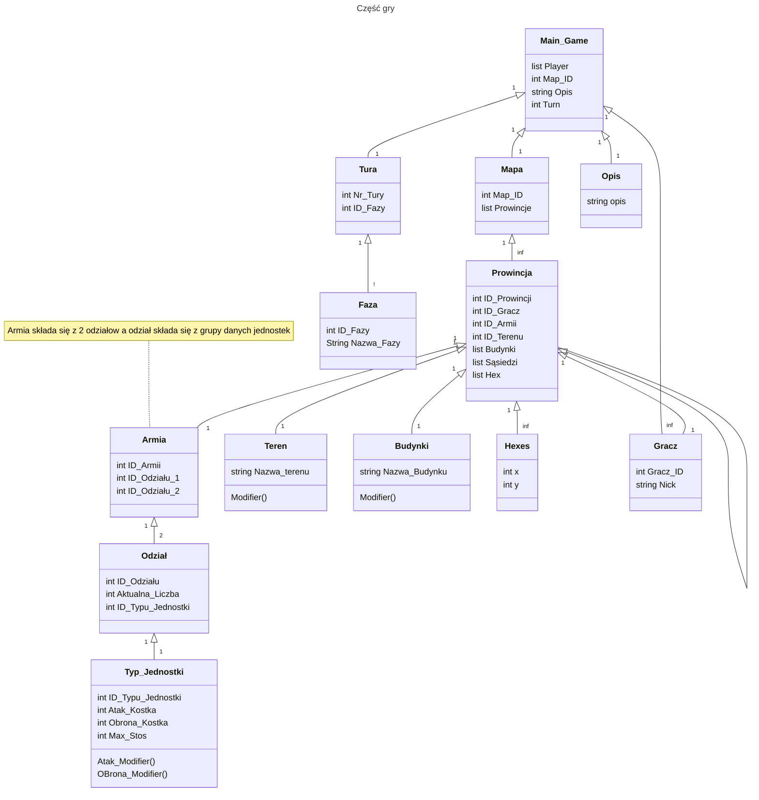

```mermaid

---
title: Część gry
---
classDiagram
    Odział "1" <|-- "1" Typ_Jednostki
    Armia "1" <|-- "2" Odział
    Prowincja "1" <|-- "1" Armia
    Prowincja "1" <|-- "1" Teren
    Prowincja "1" <|-- "1" Budynki
    Prowincja "1" <|-- "inf" Hexes
    Mapa "1" <|-- "inf" Prowincja
    Main_Game "1" <|-- "1" Mapa
    Main_Game "1" <|-- "inf" Gracz
    Main_Game "1" <|-- "1" Tura
    Tura "1" <|-- "!" Faza
    Main_Game "1" <|-- "1" Opis
    Prowincja <|-- Prowincja
    Prowincja "1" <|-- "1" Gracz
    note for Armia "Armia składa się z 2 odziałow a odział składa się z grupy danych jednostek"
    
    
    class Main_Game{
        list Player
        int Map_ID
        string Opis
        int Turn
    }

    class Tura{
        int Nr_Tury
        int ID_Fazy
    }

    class Opis{
        string opis
    }

    class Faza{
        int ID_Fazy
        String Nazwa_Fazy
    }
    
    class Gracz{
        int Gracz_ID
        string Nick
    }

    class Mapa{
        int Map_ID
        list Prowincje
    }
    
    class Prowincja{
        int ID_Prowincji
        int ID_Gracz
        int ID_Armii
        int ID_Terenu
        list Budynki
        list Sąsiedzi
        list Hex
    }

    class Typ_Jednostki{
        int ID_Typu_Jednostki
        int Atak_Kostka
        Atak_Modifier()
        int Obrona_Kostka
        OBrona_Modifier()
        int Max_Stos 
    }

    class Odział{
        int ID_Odziału
        int Aktualna_Liczba
        int ID_Typu_Jednostki
    }

    class Armia{
        int ID_Armii
        int ID_Odziału_1
        int ID_Odziału_2
    }

    class Teren{
        string Nazwa_terenu
        Modifier()
    }

    class Budynki{
        string Nazwa_Budynku
        Modifier()
    }

    class Hexes{
        int x
        int y
    }

```
