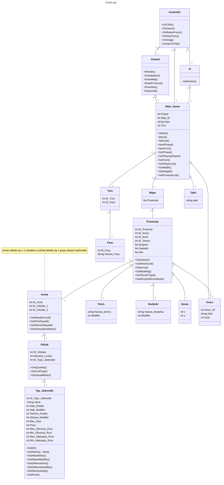

```mermaid

---
title: Część gry
---
classDiagram
    Odział "1" <|-- "1" Typ_Jednostki
    Armia "1" <|-- "2" Odział
    Prowincja "1" <|-- "1" Armia
    Prowincja "1" <|-- "1" Teren
    Prowincja "1" <|-- "1" Budynki
    Prowincja "1" <|-- "*" Hexes
    Mapa "1" <|-- "*" Prowincja
    Main_Game "1" <|-- "1" Mapa
    Main_Game "1" <|-- "*" Gracz
    Main_Game "1" <|-- "1" Tura
    Tura "1" <|-- "1" Faza
    Main_Game "1" <|-- "1" Opis
    Prowincja "1" <|-- "1" Gracz
    ControlUI "1" <|-- "1" DrawUI
    DrawUI "1" <|-- "1" Main_Game
    ControlUI "1" <|-- "1" Main_Game
    ControlUI "1" <|-- "1" Ai
    Ai "1" <|-- "1" Main_Game
    
    note for Armia "Armia składa się z 2 odziałow a odział składa się z grupy danych jednostek"

    class Ai{
        +GetAction()
    }

    class ControlUI{
        +OnClick()
        +OnHover()
        +OnButtonPress()
        +OnKeyPress()
        +OnDrag()
        +CenterOnTile()
    }

    class DrawUI{
        +Render()
        +DrawButton()
        +DrawMap()
        +DrawProvince()
        +DrawHex()
        +DrawUnit()
    }

    class Main_Game{
        list Player
        int Map_ID
        string Opis
        int Turn

        +Attack()
        +Move()
        +SetUnit()
        +NextPhase()
        +NextTurn()

        +GetPhase()
        +GetPlayingPlayer()
        +GetTurn()
        +GetPlayerList()
        +GetWidth()
        +GetHeight()
        +GetProvinesList()

        
    }

    class Tura{
        int Nr_Tury
        int ID_Fazy
    }

    class Opis{
        string opis
    }

    class Faza{
        int ID_Fazy
        String Nazwa_Fazy
    }
    
    class Gracz{
        int Gracz_ID
        string Nick
        int Gold
    }

    class Mapa{
        list Prowincje
    }
    
    class Prowincja{
        int ID_Prowincji
        int ID_Gracz
        int ID_Armii
        int ID_Terenu
        list Budynki
        list Sąsiedzi
        list Hex

        +GetOwner()
        +GetHexesList()
        +GetArmy()
        +GetBuilding()
        +GetTerrainType()
        +GetArmyDefenceMean()
    }

    class Typ_Jednostki{
        int ID_Typu_Jednostki
        -string name
        int Atak_Kostka
        int Atak_Modifier
        int Obrona_Kostka
        int Obrona_Modifier
        int Max_Stos
        int Price
        int Max_Obronny_Rzut
        int Min_Obronny_Rzut
        int Max_Atakujący_Rzut
        int Min_Atakujacy_Rzut

        +GetID()
        +GetName() string
        +GetAttackDice()
        +GetAttackModifier()
        +GetDefenseDice()
        +GetDefenseModifier()
        +GetMaxQuantity()
        +GetPrice()
    }

    class Odział{
        int ID_Odziału
        int Aktualna_Liczba
        int ID_Typu_Jednostki

        +GetQuantity()
        +GetUnitType()
        +GetSquadMean()
    }

    class Armia{
        int ID_Armii
        int ID_Odziału_1
        int ID_Odziału_2

        +GetSquadCount()
        +GetFirstSquad()
        +GetSecondSquad()
        +GetArmyAttackMean()
    }

    class Teren{
        string Nazwa_terenu
        int Modifier
    }

    class Budynki{
        string Nazwa_Budynku
        int Modifier
    }

    class Hexes{
        int x
        int y
    }


```
