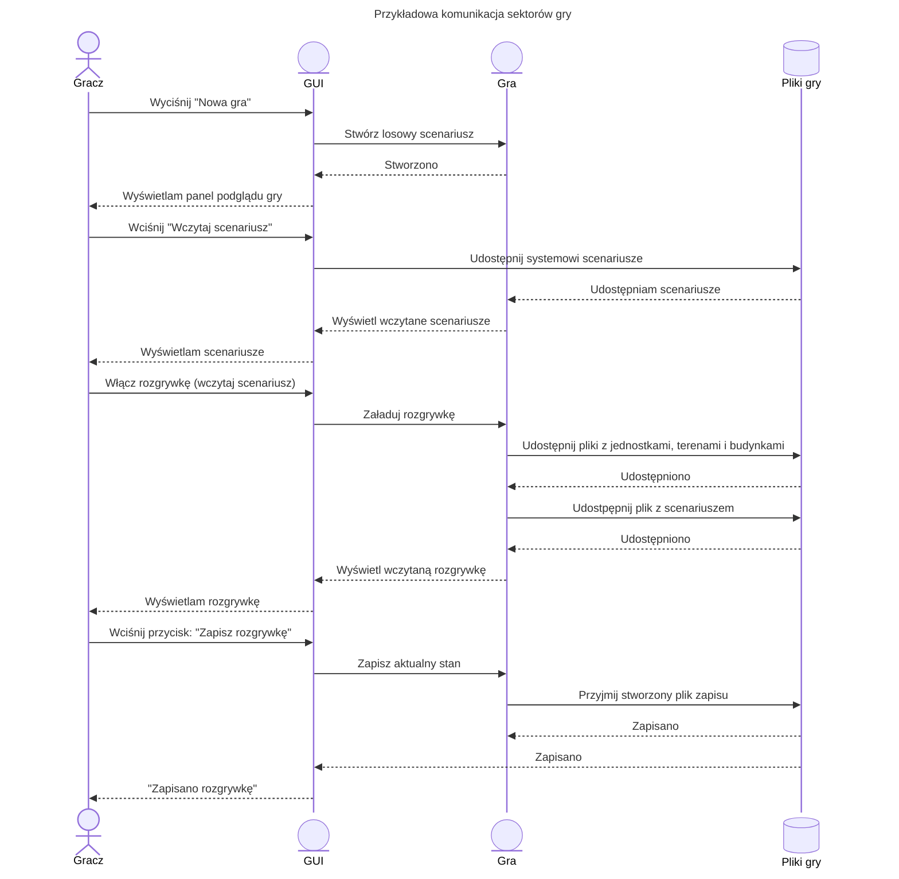

```mermaid

---
title: Przykładowa komunikacja sektorów gry
---

sequenceDiagram
    participant Gracz@{ "type": "actor", "alias": "Gracz" }
    participant GUI@{ "type": "entity", "alias": "GUI" }
    participant Game@{ "type": "entity", "alias": "Gra" }
    participant Database@{ "type": "database", "alias": "Pliki gry" }
    
    Gracz ->> GUI: Wyciśnij "Nowa gra"
    GUI ->> Game: Stwórz losowy scenariusz
    Game -->> GUI: Stworzono
    GUI -->> Gracz: Wyświetlam panel podglądu gry

    Gracz ->> GUI: Wciśnij "Wczytaj scenariusz"
    GUI ->> Database: Udostępnij systemowi scenariusze
    Database -->> Game: Udostępniam scenariusze
    Game-->> GUI: Wyświetl wczytane scenariusze
    GUI-->> Gracz: Wyświetlam scenariusze
    
    Gracz ->> GUI: Włącz rozgrywkę (wczytaj scenariusz) 
    GUI ->> Game: Załaduj rozgrywkę
    Game ->> Database: Udostępnij pliki z jednostkami, terenami i budynkami
    Database -->> Game: Udostępniono
    Game ->> Database: Udostpępnij plik z scenariuszem
    Database -->> Game: Udostępniono
    Game -->> GUI: Wyświetl wczytaną rozgrywkę
    GUI -->> Gracz: Wyświetlam rozgrywkę

    Gracz ->> GUI: Wciśnij przycisk: "Zapisz rozgrywkę"
    GUI ->> Game: Zapisz aktualny stan
    Game ->> Database: Przyjmij stworzony plik zapisu
    Database -->> Game: Zapisano
    Database -->> GUI: Zapisano
    GUI -->> Gracz: "Zapisano rozgrywkę"

```
